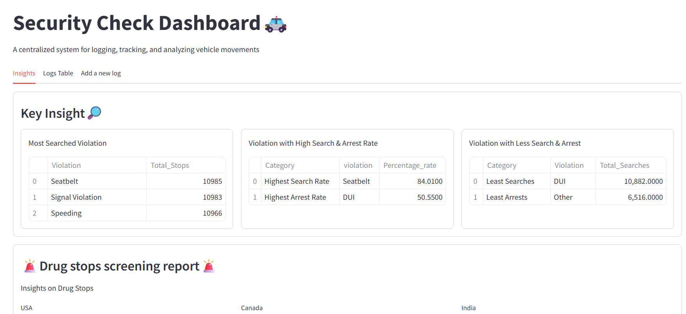
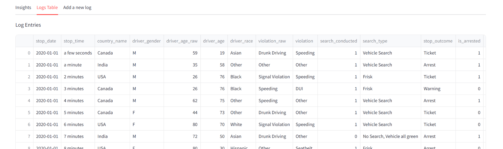
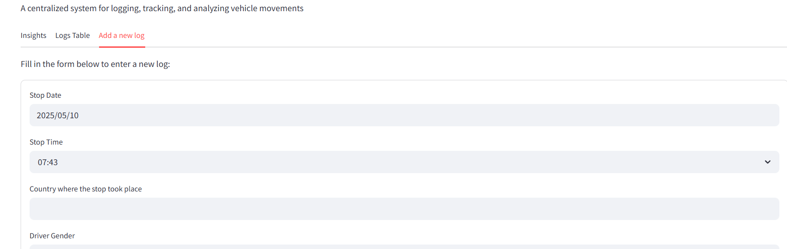
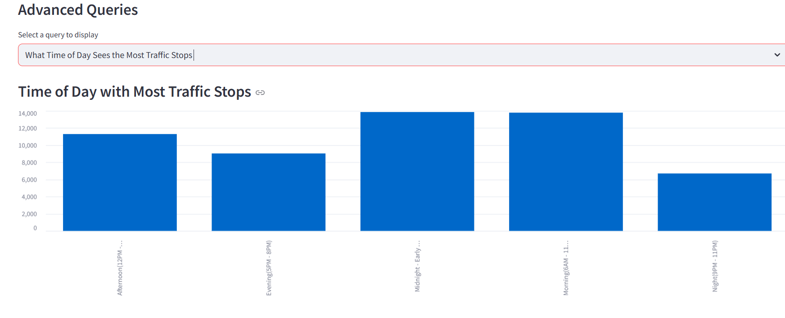

# 🚓 SecureCheck Dashboard

**SecureCheck Dashboard** is a real-time analytics platform built with **Streamlit**, **MySQL**, and **Python** to monitor, analyze, and log law enforcement traffic stops and violations across countries.

---

## 📊 Features

- 🔍 **Advanced Query Selector** for detailed data exploration
- 📈 **Interactive Visualizations** (bar charts, metrics, tables)
- 🧾 **Add New Log** form with validation
- 🌍 **Country & Demographic-level Analytics**
- 🚨 **Drug-related Stops & Violation Trends**

---

## 🚀 How to Run

1. Clone this repo
2. Install requirements: `pip install -r libraries_needed.txt`
3. Start the app: `streamlit run app.py`

```bash
pip install -r requirements.txt
streamlit run app.py

---

## Screenshots





---

## 📌 Project Structure

SecureCheck_Dashboard/
│
├── app.py                  # 🚀 Streamlit dashboard
├── DB_utils.py             # 🔌 SQL query functions
├── DB_config.py            # 🔐 Database connection config
├── Clean_data_note.ipynb   # 📓 Jupyter notebook showing data cleaning process
├── cleaned_data.sql        # 🧾 Optional: SQL dump of cleaned data
├── requirements.txt        # 📦 Python dependencies
└── README.md               # 📘 Project documentation (auto-visible on GitHub)

---

## 🧹 Data Cleaning Process

The raw Excel data was cleaned and transformed using the steps documented in the `clean_data_note.ipynb` notebook. Key operations included:

- Handling nulls in the `search_type` column
- Type conversion for `stop_date` and `stop_time`
- Standardizing violation categories
- Splitting raw and confirmed driver ages
- Ensuring MySQL-compatible formatting

You can open the notebook in Jupyter or Colab to explore the data cleaning logic.
